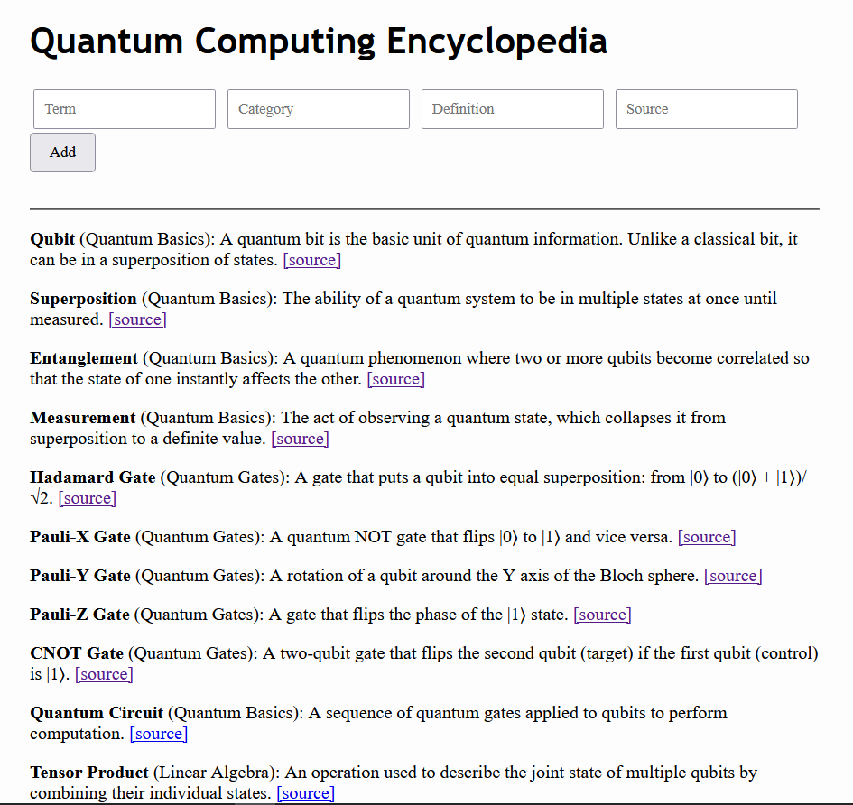

#  QuantumCompEncyclopedia 

[](https://www.python.org/)
[](https://flask.palletsprojects.com/)
[](./LICENSE)

**QuantumCompEncyclopedia** is a simple educational web app that displays and organizes key terms in quantum computing. It uses a local **SQLite** database and a **Flask** interface to help students and enthusiasts learn and reference concepts with definitions and sources.

---

## Home Page


---

## Features
- Searchable database of quantum computing terms
- Categorized entries
- Each term includes a definition and reference source
- Responsive web interface using Flask
- SQLite database backend with provided SQL setup script

---

## Getting Started

### Requirements

- Python 3.8+
- pip
- flask 2.0+

### Installation

1. **Clone the repository**
   ```bash
   git clone https://github.com/ELahiani/QuantumCompEncyclopedia.git
   cd QuantumCompEncyclopedia
   ```

---

2. **Other Optional Stuff**
Create and activate a virtual environment
   ```bash
   python -m venv venv
   source venv/bin/activate        # On Windows: venv\Scripts\activate
   ```
Install required packages
```bash
pip install -r required_installs.txt
# OR manually:
pip install Flask

```
Set up the SQLite database only needed if quantum.db doesn't already exist.
```bash
sqlite3 quantum.db < quantum_definitions.sql
```
Run the application
```bash
python app.py
```
View in your browser
```bash
http://127.0.0.1:5000
```

---

Made with ❤️ by Eya Lahiani
